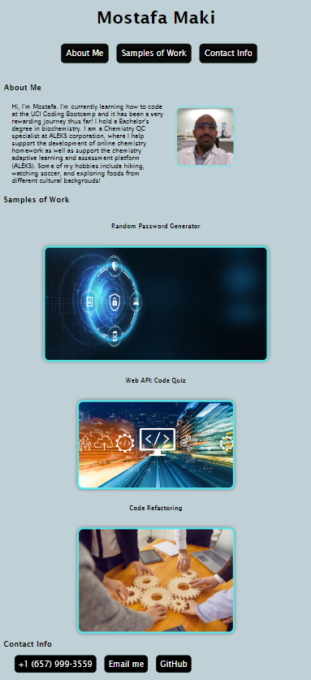

# Mostafa's Professional Portfolio

In this application, you will my Portfolio. I have included a header and a simple navigation layout at the top of the page to enable the user to identify an overview of the whole application. These include an About me section, Samples of Work, and a Contant me section.
The links at the top bar links to the corresponding section on the application.
In the About Me section, I've included a brief paragraph describing my background and interest. I've also included a profile picture.
In the next section, Samples of Work, I have included placeholder images that are linked to projects that I will be working on and that I want to show case. This section is still being updated and should be updated accordingly. I have enlarged the first sample of work (Password Generator) as it will be a good way to communicate some aspects of my skills.
Finally, I have included my phone number, email address, and GitHub profile link in the Contact Me section for the user to reference.
---
Overall, this application demonstrates the 'responsive layout' design such that if viewed on a mobile device or a laptop, the content would still be legible.
---
## [Link to Deployed Application](https://momaki9.github.io/Professional_Portfolio/)

----
----
## 
----
----
        
